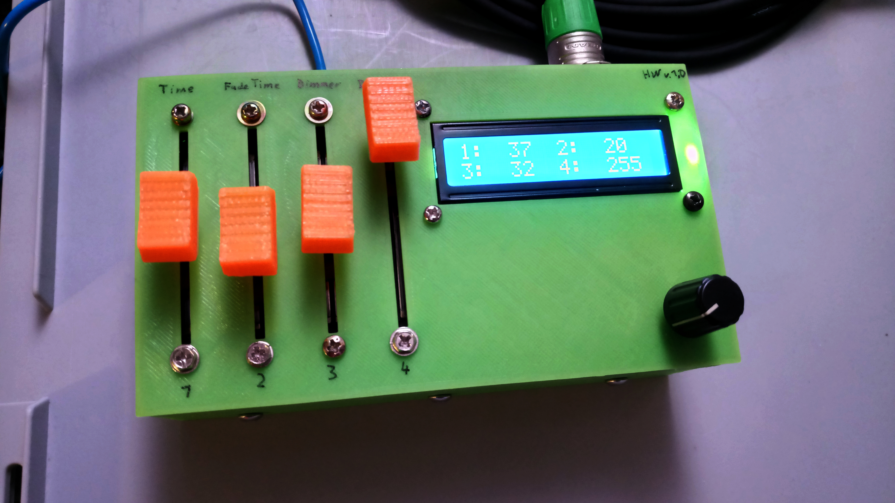

# DMX-Console-ATmega328P

A cheap and basic DMX console based on an ATmega328P

## About the Project

This DMX console is build for easy tasks like controlling a few spots, running a chaser for a light strip in the background or just testing DMX controlled lamps.
It is easy to use and build.

### Features

* Manual control of 72 DMX channels
* 3 Chaser banks which each contains 20 scenes, that stores the first 8 DMX channels
* Alltogether 60 Scenes store- and recallable
* Chaser parameter with faders settable (scenetime, fadetime, dimmer, direction)
* Startmode settable (manual, scene recall, chaser)
* relativly cheap (under 30€)

### Libaries used

* Arduino
* EEPROM
* marcoschwartz/LiquidCrystal_I2C@^1.1.4
* mathertel/RotaryEncoder@^1.5.2
* paulstoffregen/DmxSimple@^3.1 (modified, details in software folder)

### License

This project stands under the GNU GPLv3 License - see the LICENSE.md file for details.

## How2 Build

The circuit and BOM is in the hardware folder.
Build the "mainboard" on a perfboard and connect the faders, the LCD, ... with it.
You can also add a voltage regulator to use it with higher voltage.

To flash the software, connect the console (through a programmer) to your computer (if you are using a new ATmega328P you should burn a fitting bootloader first to set the fuses right).
Upload the prepare program (which updates the EEPROM to right start values).
Upload the main program.

Now you can build the components in a fitting case (you find an example in the hardware folder).
